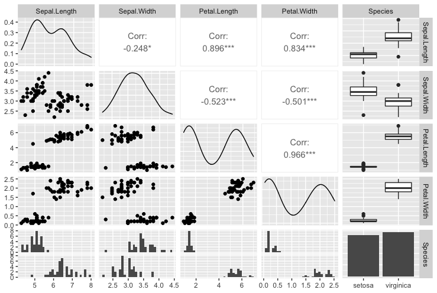
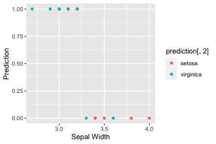

# Logistic regression analysis

1. [Description of data](#1-description-of-data)
2. [Description of the problem](#2-description-of-the-problem)
3. [Description of the techniques used](#3-description-of-the-techniques-used)
4. [Descriptions of results](#4-descriptions-of-results)

## 1. Description of data

In this assignment a dataset from the UCI Machine Learning Repository was used. The dataset is called Edgar Anderson's Iris Data. It was downloaded from [here](https://archive.ics.uci.edu/ml/datasets/iris)

* Number of rows: 150
* Number of attributes: 5

Attribute Information:

| Column name      | Type        |Description                                                                       |
|------------------|-------------|----------------------------------------------------------------------------------|
| Sepal length     | Numerical   |  Measurements in centimeters of the variables sepal length                       |
| Sepal width      | Numerical   |  Measurements in centimeters of the variables sepal width                        |
| Petal length     | Numerical   |  measurements in centimeters of the variables petal length                       |
| Petal width      | Numerical   |  Measurements in centimeters of the variables petal width                        |
| Species          | Categorical |  Species of iris. Possible values: Iris Setosa, Iris Versicolour, Iris Virginica |

## 2. Description of the problem 

This assignment aims to design an appropriate model to predict the species of the Iris plant. Find what attributes are needed for logistics regression? Also, find how different variables are related to each other?

## 3. Description of the techniques used

First of all, I started with data exploration. One of the first steps was to check if there any missing values in the dataset. After this step, I confirmed that there are no NA values, and the dataset is complete. 

Based on logistic regression theory, only two species of plants out of 3 can be used.  Thus, I picked setosa and virginica types of flowers for my model. 

Then data was divided into two subsets, where one part was training data, and another one is test data. Usually, it 80 and 20 percent 
respectively, but in my case it was 75% and 25%. Training data was used to train my model, and test data was used to test the results and to predict values.

For dataset exploration a plot was built. I have used function ‘ggpairs’ from ‘GGally’ package to build it. The resulting plot is presented below:

After looking at the plot, I fitted my Logistic Regression. In this model a simple regression was used to get the probability, whether it is a plant 'setosa' or 'virginica' based on its 'Sepal Width'.

## 4. Descriptions of results

If we look at the model, p-values are significantly high, which is a good indicator. 

Previously, test data was used to determine how well the model can classify it. As an example, below there is a visualization with some predictions.

